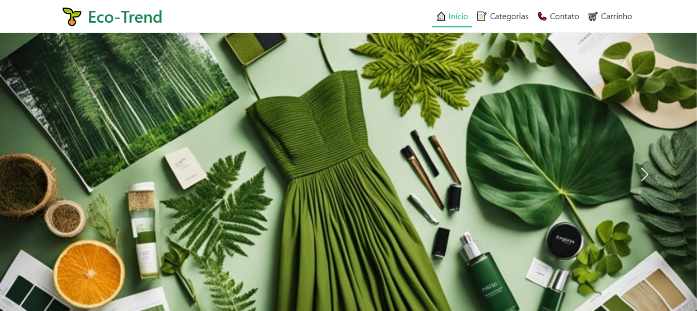

# Front-End - Eco-Trend

## 🧠 1. Descrição

A Eco-Trend é um e-commerce dedicado a promover um estilo de vida mais consciente e sustentável, oferecendo uma variedade de produtos ecológicos. Nosso objetivo é facilitar a transição para um consumo mais responsável, unindo estilo, bem-estar e tecnologia verde. Acreditamos que pequenas escolhas diárias podem gerar um grande impacto positivo no planeta.



---

## 🚀 2. Como executar  

1. Clone este repositório  
    ```bash
        git clone https://github.com/1IMperaDOR0/eco-trend.github.io.git
    ```

2. Abra o arquivo `index.html` diretamente no navegador

> Não é necessário instalar dependências – todo o projeto roda apenas com HTML, CSS e Bootstrap.

---

## 🧭 3. Estrutura geral/padronizada (comum em todas as páginas)

### Cabeçalho (`<nav>`)
- Logo clicável (`🌱 Eco-Trend`) que redireciona para a página inicial (`index.html`).
- Menu de navegação com links para: Início (`index.html`), Categorias (`src/pages/categorias.html`), Contato (`src/pages/contato.html`) e Carrinho (`#`).
- Menu responsivo com `navbar-toggler` do Bootstrap, ativado via JavaScript (Bootstrap Bundle).
- A navegação se adapta automaticamente com os breakpoints do Bootstrap.

### Rodapé (`<footer>`)
- Presente em todas as páginas.
- Seções de contato, políticas e redes sociais.
- Mensagem de copyright (`© 2025 Eco-Trend | Produtos Sustentáveis para um Futuro Melhor 🌍`).

### JavaScript
- O arquivo `bootstrap.bundle.min.js` é utilizado para o funcionamento do menu responsivo, carrossel e outros componentes interativos do Bootstrap.
- Há alguns arquivos JavaScript personalizados, porém a interatividade principal é gerenciada pelo Bootstrap.

---

## 📄 4. Páginas e funções específicas

### 🏠 `index.html` – Início
> Apresenta as principais categorias de produtos e um carrossel de destaque.

Seções principais:
- **Carrossel Eco-Trend**: Um carrossel de imagens rotativo (`#carouselEcoTrend`) que destaca diferentes aspectos da sustentabilidade (Moda Sustentável, Beleza Natural, Tecnologia Verde).
- **Roupas e Acessórios Sustentáveis**: Uma seção dedicada a produtos de moda, com uma breve descrição e uma imagem ilustrativa. Botão "Saiba Mais" que leva para a página de categorias.
- **Beleza e Cuidados Pessoais**: Apresenta produtos de beleza natural, com descrição e imagem. Botão "Saiba Mais" que leva para a página de categorias.
- **Itens para Casa**: Destaque para produtos ecológicos para o lar, com descrição e imagem. Botão "Saiba Mais" que leva para a página de categorias. 
- **Tecnologia Verde**: Seção sobre gadgets e soluções tecnológicas sustentáveis, com descrição e imagem. Botão "Saiba Mais" que leva para a página de categorias.

---

### 📝 `categorias.html` – Categorias
> Exibe os produtos organizados por categoria, com detalhes, preços e status.

Estrutura:
- **Cabeçalho de Categoria**: Título da página com ícone (`fas fa-leaf`) e uma descrição convidativa.
- **Moda Sustentável**: Seção de produtos como camisetas orgânicas, calças jeans recicladas, bolsas e tênis ecológicos. Cada produto possui:
    - Imagem (`roupas_e_acessorios.png`).
    - Título, descrição, preço e avaliação em estrelas.
    - Badges de status (Disponível, Esgotado, Promoção, Novo).
    - Botões "Adicionar ao Carrinho" ou "Indisponível".
- **Beleza Natural**: Produtos como shampoo natural, hidratante facial, sabonete artesanal e óleo corporal. Segue o mesmo padrão de cards de produto.
    - Imagem (`belezas_e_cuidados.png`).
- **Itens para Casa**: Inclui escova de bambu, detergente ecológico, lâmpada LED e composteira doméstica.
    - Imagem (`itens_casa.png`).
- **Tecnologia Verde**: Produtos como carregador solar, smart plug, sensor de umidade e purificador de ar.
    - Imagem (`tecnologia_verde.png`).

---

### 📞 `contato.html` – Contato
> Oferece informações de contato, um formulário e uma seção de Perguntas Frequentes.

Estrutura:
- **Cabeçalho de Contato**: Título da página com ícone (`fas fa-envelope`) e uma descrição.
- **Informações de Contato**: Card lateral com detalhes como endereço, telefone, e-mail e horário de funcionamento, cada um com um ícone (`contact-icon`).
- **Envie sua Mensagem**: Formulário de contato completo com campos para Nome, E-mail, Telefone, Assunto (dropdown) e Mensagem (textarea). Inclui um checkbox para newsletter e um botão de envio.
- **Perguntas Frequentes (FAQ)**: Seção com um `accordion` do Bootstrap, contendo perguntas e respostas sobre rastreamento, entrega, política de devolução e sustentabilidade dos produtos.
- **Siga-nos nas Redes Sociais**: Seção com ícones clicáveis para Facebook, Instagram, Twitter, YouTube e LinkedIn.

---

## 🎯 Resumo da estrutura

| Página                | Propósito                                            | Destaques                                                                      |
|-----------------------|------------------------------------------------------|--------------------------------------------------------------------------------|
| `index.html`          | Apresentação geral e destaques                       | Carrossel, seções por categoria com botões "Saiba Mais"                        |
| `categorias.html`     | Catálogo detalhado de produtos                       | Cards de produto com status, preços, avaliações e botões de adição ao carrinho |
| `contato.html`        | Canal de comunicação e suporte                       | Informações de contato, formulário, FAQ e links de redes sociais               |

---

## 😎 Efeitos visuais

### Globais (`style.css`)  
- **Navbar**: fundo semitransparente com blur e hover animado nos links.  
- **Footer**: gradiente escuro com links que mudam de cor no hover.  

### Home (`home.css`)  
- **Carrossel**: imagens em tela cheia com `object-fit: cover`.  
- **Categorias**: títulos verdes em destaque.  
- **Botões "Saiba Mais"**: verde, arredondados e com efeito de escala no hover.  

### Contato (`contato.css`)  
- **Header**: gradiente verde com textura.  
- **Cards/Formulário**: bordas arredondadas, sombras e animações sutis.  
- **Ícones/Redes sociais**: círculos verdes com efeito de destaque no hover.  
- **FAQ**: accordion estilizado em verde.  

### Categorias (`categorias.css`)  
- **Header**: mesmo gradiente da página de contato.  
- **Cards**: efeito de elevação e zoom nas imagens.  
- **Badges**: cores por status (verde, vermelho, laranja, azul).  
- **Botões/Preços/Avaliações**: estilos personalizados para cada situação.  
- **Animações**: fade-in nos cards e brilho em promoções.  

---

## 👥 Integrantes A-Z

- Gabriel Alexandre Fukushima Sakura
- Gabriel Oliveira Amaral
- Lucas Henrique Viana Estevam Sena
- Rafael Tavares Santos

---

## Links

- Solution URL: [https://github.com/1IMperaDOR0/eco-trend.github.io](https://github.com/1IMperaDOR0/eco-trend.github.io)
- Live Site URL: [https://1IMperaDOR0.github.io/eco-trend.github.io/](https://1IMperaDOR0.github.io/eco-trend.github.io/)

## 📜 Licença

Projeto acadêmico. Uso livre para fins educacionais.